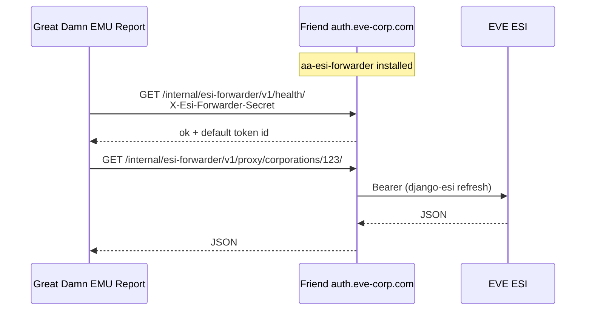

# ESI forwarder + Great Damn EMU Report (including external AA5)

## Repos

| Repo | Role |
|------|------|
| [aa-esi-forwarder](../repos/aa-esi-forwarder/) | Runs **on each** Alliance Auth 5 site that shares ESI |
| [aa-report-bridge](../repos/aa-report-bridge/) | Webhooks + read-only export (AA DB snapshots, not raw SQL) |
| [great-damn-emu-report](../repos/great-damn-emu-report/) | Central reporting; ESI + ingest + history |

## External linking flow



1. Friend installs forwarder, creates API key `emu-report:secret`.
2. Friend exposes only `/internal/esi-forwarder/*` on HTTPS.
3. You add a **link** in Great Damn EMU Report (`connections.json` or admin API).
4. Reports use `/v1/links/{link_id}/…` — no change when you add more corps.

## eve-emu (home AA)

Same as friends: install `aa_esi_forwarder` on `aa-web`, set `ESI_FORWARDER_API_KEYS`, add link `id: home` pointing at `https://auth.eve-emu.com`.

## Compose example (report service)

```yaml
  emu-report:
    build:
      context: ./repos
      dockerfile: great-damn-emu-report/Dockerfile
    volumes:
      - ./repos/great-damn-emu-report/data:/app/data
    environment:
      REPORT_CONNECTIONS_FILE: /app/data/connections.json
      REPORT_ADMIN_API_KEY: ${EMU_REPORT_ADMIN_KEY}
    expose: ["8020"]
```

Do not publish port 8020 without your own auth layer in front.

For **webhooks and historical AA data**, see [REPORT_BRIDGE.md](./REPORT_BRIDGE.md).
