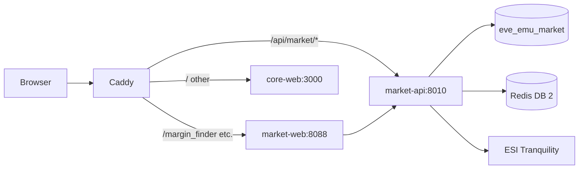

# Public market tools (eve-emu.com)

Dark-mode market suite inspired by [Adam4EVE](https://www.adam4eve.eu/margin_finder.php) and [isk.gg](https://isk.gg/market-browser), scoped to the **W O M P S T A R** player-owned market (`3-FKCZ`) with optional **Jita import** comparison and links to the internal **buyback** calculator.

## URLs (apex `https://<DOMAIN_NAME>`)

| Path | Adam4EVE analogue | Status |
|------|-------------------|--------|
| `/margin_finder` | [margin_finder.php](https://www.adam4eve.eu/margin_finder.php) | Live API + UI |
| `/market-browser` | isk.gg-style browser | Live API + UI (per-type orders) |
| `/market_trends` | [market_trends.php](https://www.adam4eve.eu/market_trends.php) | UI stub; sync TBD |
| `/contract_price` | [contract_price.php](https://www.adam4eve.eu/contract_price.php) | UI stub; WOMP contracts sync TBD |
| `/tradeVol_type` | [tradeVol_type.php](https://www.adam4eve.eu/tradeVol_type.php) | Live API + charts (30d default, hub vs Jita/Amarr) |
| `/price_compare` | [price_compare.php](https://www.adam4eve.eu/price_compare.php) | UI stub |
| `/pi_rank` | [pi_rank.php](https://www.adam4eve.eu/pi_rank.php) | Live API + charts (EVE Ref schematics, Jita/Amarr/WOMP) |
| `/appraisal` | [Janice](https://janice.e-351.com) | Paste appraisal + WOMPSTAR hub columns |

API: `GET /api/market/v1/...` (OpenAPI at `/api/market/docs` when enabled).

## Architecture



- **`market-tools/`** — FastAPI, Postgres cache, APScheduler structure-order sync, Redis ESI pacing.
- **`market-web/`** — Static SPA (shared `theme.css`, path-based routes).
- **Dedicated ESI app** — `MARKET_ESI_*` in root `.env` (separate from core/AA keys).

## Configuration

Copy from `.env.example` section `[MARKET_TOOLS]`:

| Variable | Purpose |
|----------|---------|
| `MARKET_INTERNAL_SECRET` | Shared secret for `aa-web` → `market-api` token bridge (required) |
| `MARKET_USE_AA_TOKEN` | `1` (default) — use Sevey's AA token via internal bridge |
| `MARKET_ESI_TOKEN_ID` | django-esi token pk (**58** = Lamaashtu, False Gods corp + structure markets) |
| `MARKET_ESI_CHARACTER_NAME` | Fallback lookup if token id unset (**Sevey**) |
| `MARKET_WOMPSTAR_STRUCTURE_ID` | **1050645565626** (from CorpTools `EveLocation` / show info) |
| `MARKET_BUYBACK_PUBLIC_URL` | e.g. `https://auth.eve-emu.com/buyback_v2/` |

Optional: set `MARKET_USE_AA_TOKEN=0` and use a dedicated CCP app + `MARKET_ESI_REFRESH_TOKEN` instead.

Optional: `MARKET_DEFAULT_IMPORT_REGION_ID` (10000002 = The Forge), contract corp IDs for WOMP alliance contract grids.

## Deploy

```bash
# New DB on fresh volume: deploy/postgres/initdb/04-create-market-db.sql runs automatically.
# Existing volume:
docker compose exec db psql -U eve -c "CREATE DATABASE eve_emu_market OWNER eve;"

docker compose build market-api market-web
docker compose up -d market-api market-web
docker compose exec caddy caddy reload --config /etc/caddy/Caddyfile
```

Verify:

```bash
curl -s https://eve-emu.com/api/market/v1/health
curl -s https://eve-emu.com/api/market/v1/meta
```

## Performance

- Public pages read **cached Postgres** data (no per-request ESI for table views).
- Structure orders refresh on an interval (`MARKET_STRUCTURE_ORDERS_SYNC_INTERVAL_MINUTES`, default 10).
- ESI calls use **Redis + minimum interval** and honor `X-Esi-Error-Limit-*` headers.

## Next implementation steps

1. Region/station import picker (Jita default) on margin finder and price compare.
2. `market_trends` category boards + history rollups from `market_history_days`.
3. Corporation contract ingest for WOMP (`esi-contracts.*`) → `contract_price_days`.
5. Appraisal paste → line items + deep link to buyback_v2 with pre-filled paste.

Market group hierarchy is loaded from [EVE Ref reference data](https://ref-data.everef.net/market_groups) (same tree as [everef.net/market-groups](https://everef.net/market-groups)). Refresh: `POST /api/market/v1/sync/groups`.
