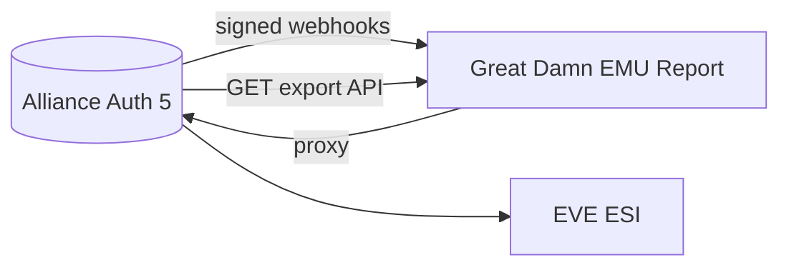

# AA Report Bridge

Alliance Auth 5 plugin for **The Great Damn EMU Report** (and similar consumers). Combines:

1. **Webhooks** — AA pushes signed JSON when watched rows change (live updates).
2. **Read-only export API** — consumer pulls paginated snapshots for **historical** backfill (curated tables, not raw DB dumps).
3. Works alongside **[aa-esi-forwarder](../aa-esi-forwarder/)** for live **ESI** calls.

## Architecture



| Channel | Direction | Use |
|---------|-----------|-----|
| Webhook | AA → Report | Real-time membership, groups, mining tax rows, etc. |
| Export API | Report → AA | Initial load + nightly backfill / audit |
| ESI forwarder | Report → AA → ESI | Wallets, assets, corp sheet (scopes on token) |

## Install on AA5

```python
INSTALLED_APPS += [
    "aa_esi_forwarder.apps.AaEsiForwarderConfig",
    "aa_report_bridge.apps.AaReportBridgeConfig",
]
```

```env
# Same consumer id as forwarder is fine
REPORT_BRIDGE_API_KEYS=emu-report:LONG_RANDOM_SECRET
REPORT_BRIDGE_ALLOWED_IPS=203.0.113.10/32
REPORT_BRIDGE_SITE_ID=eve-emu

# Push changes to your report service
REPORT_BRIDGE_WEBHOOK_URL=https://report.yoursite.com/v1/ingest/eve-emu
REPORT_BRIDGE_WEBHOOK_SECRET=SAME_SECRET_AS_REPORT_INGEST

# Optional: limit which models fire webhooks (comma-separated)
# REPORT_BRIDGE_WATCH_MODELS=auth.User,auth.Group,eveonline.EveCharacter,memberaudit.Character,miningtaxes.Character
```

Expose on HTTPS (Caddy):

```caddyfile
handle /internal/report-bridge/* {
    reverse_proxy aa-web:8080
}
handle /internal/esi-forwarder/* {
    reverse_proxy aa-web:8080
}
```

## Export API (consumer → AA)

| Endpoint | Purpose |
|----------|---------|
| `GET …/health/` | Link test |
| `GET …/resources/` | List exportable resources |
| `GET …/export/{resource}/?limit=&offset=&since=` | Paginated snapshot |
| `POST …/webhooks/test/` | Fire one test webhook |

Auth: `X-Report-Bridge-Secret` or `Authorization: Bearer` (same key as `REPORT_BRIDGE_API_KEYS`).

Built-in resources:

| Resource | Data |
|----------|------|
| `auth.user` | Users + group ids |
| `auth.group` | Django groups (Discord role names) |
| `eveonline.evecharacter` | Linked characters |
| `memberaudit.character` | If Member Audit installed |
| `miningtaxes.character` | If Mining Taxes installed |

Add more in `exporters.py` for your corp-specific apps.

## Webhook payload

```json
{
  "event_id": "uuid",
  "site_id": "eve-emu",
  "event": "aa.record.changed",
  "action": "update",
  "occurred_at": "2026-05-28T12:00:00+00:00",
  "payload": {
    "model": "auth.user",
    "action": "update",
    "record": { "id": 1, "username": "foo", "group_ids": [3, 7] }
  }
}
```

Header: `X-Report-Webhook-Signature: sha256=<hmac of body>` using `REPORT_BRIDGE_WEBHOOK_SECRET`.

## Python client

```python
from report_bridge_client import ReportBridgeClient

client = ReportBridgeClient(
    base_url="https://auth.eve-emu.com",
    secret="LONG_RANDOM_SECRET",
)
print(client.ping())
for row in client.export_all("auth.user"):
    print(row)
```

## Related

- [aa-esi-forwarder](../aa-esi-forwarder/)
- [great-damn-emu-report](../great-damn-emu-report/)
- [docs/REPORT_BRIDGE.md](../../docs/REPORT_BRIDGE.md) (eve-emu deploy notes)
